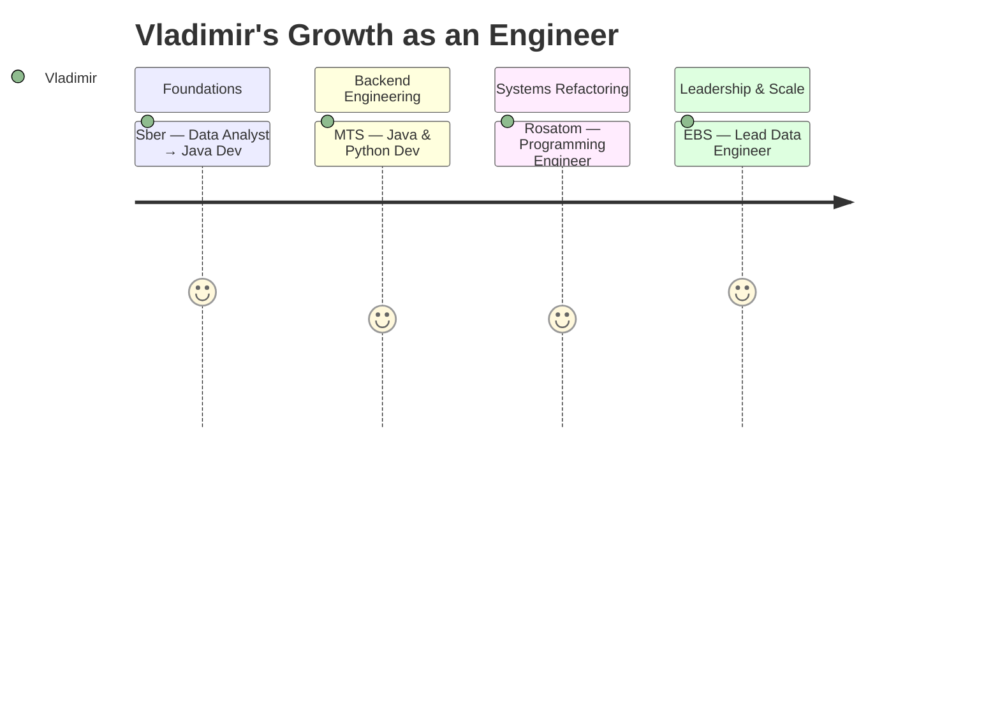

<p align="center">
  
</p>

<p align="center">
  
</p>

<p align="center">
  <code>🎓 Computer Engineering</code> &nbsp; | &nbsp;
  <code>🧠 Data & Backend Engineering</code> &nbsp; | &nbsp;
  <code>☕ Java Enthusiast</code> &nbsp; | &nbsp;
  <code>🚀 System Builder</code>
</p>

<p align="center">
  
</p>

---
## 👤 Who I Am

<p align="center">
  
</p>

<div align="center">
  
</div>

---

## 💼 My Career Roadmap


---

## 🔧 Engineering Highlights

<details>
  <summary>🚀 Real-time ETL Pipeline</summary>

* Stack: Python, Airflow, Kafka
* Resilient to schema drift, retryable
* 10M+ records/day throughput

</details>

<details>
  <summary>📈 Finance Dashboard</summary>

* Stack: Java, Spring Boot
* Aggregates real-time financial metrics
* Used across departments for reporting

</details>

<details>
  <summary>🤖 Slack DevOps Bot</summary>

* GitHub Actions + Docker
* Slack notifications for CI/CD pipelines

</details>

<details>
  <summary>🌐 Portfolio Website</summary>

* React + Tailwind + Framer Motion
* Full animated interface, deployed via GitHub Pages

</details>

---

## 🧠 My Stack

### 🌍 Languages & Frameworks

<p></p>

### 💄 Databases & Processing

<p></p>

### ⚙️ DevOps & Tools

<p></p>

---

## 🔭 Exploring Right Now

```bash
🔍 Studying   → OpenTelemetry, Jaeger
📊 Optimizing → High-throughput data ingestion
🧼 Learning   → Schema evolution patterns
📚 Reading    → Platform design & system architecture
```

---

## 📊 GitHub Insights

<p align="center">
  
  
  
</p>

---

## 🎵 Now Playing on Spotify

<p align="center">
  
</p>

---

## 🌱 Fun Facts

* 🧠 Debugged a 3AM production issue with coffee & logs
* 🎧 Engineering blogs > Netflix
* 🎮 Indie + roguelike gamer
* 🌍 Languages: Russian, English, SQL (fluently)
* 🔄 Once migrated 100M+ rows with zero downtime

---

## 📨 Where to Find Me

<p align="center">
  <a href="https://discordapp.com/users/buccellati_scumbag"></a>
  <a href="https://leetcode.com/young_carti"></a>
  <a href="https://t.me/MemyselfAndCode"></a>
  <a href="https://vk.com/daxxxak"></a>
</p>

---

<p align="center">
  
</p>
